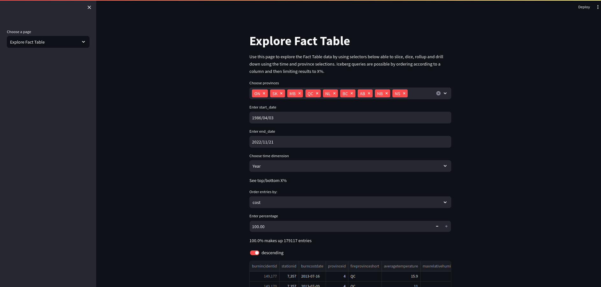
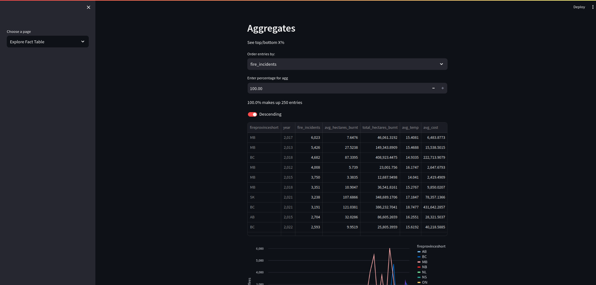
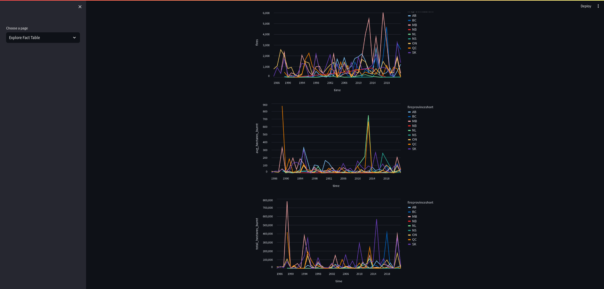
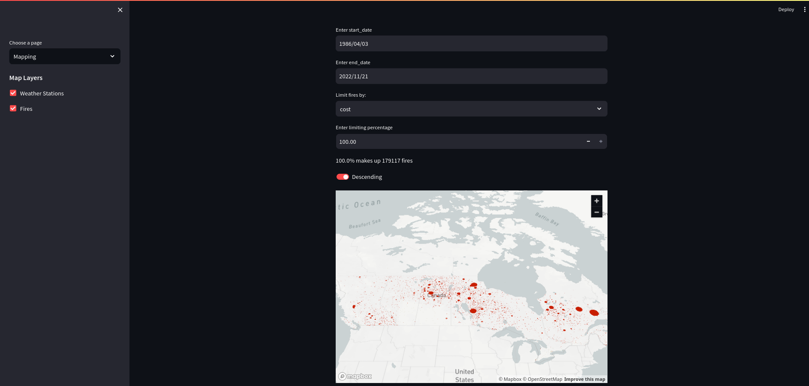

# OLAP queries and dashboard

## Requirements

To be able to run the queries found in [olap.ipynb](olap.ipynb) or the [dashboard](dashboard.py) you will first have to boot up and populate the postgres database. To do so follow [the README.md above](../README.md) and make sure to have installed all requirements by running `pip install -r src/requirements.txt`.

## OLAP queries

The OLAP queries are for the most part self explanatory and should be able to be seen and run by following the instructions in the notebook.

### OLAP Queries Listed

1. Rollup Query:
- SELECT EXTRACT(YEAR FROM burncostdate) AS year,SUM(hectaresburnt) AS hectaresburnt,SUM(cost) AS cost FROM dailyburncost GROUP BY year ORDER BY year;

2. Drilldown Query:
- SELECT EXTRACT(YEAR FROM burncostdate) AS year, fireprovinceshort AS province,SUM(hectaresburnt) AS hectaresburnt,SUM(cost) AS cost FROM dailyburncost GROUP BY GROUPING SETS ((year,province)) ORDER BY year;

3. Slice Query:
- SELECT * FROM dailyburncost WHERE EXTRACT(YEAR FROM burncostdate)=2022 ORDER BY burncostdate

4. Dice Query: 
- SELECT EXTRACT(YEAR FROM burncostdate) AS year,fireprovinceshort AS province,SUM(hectaresburnt) AS hectaresburnt,SUM(cost) AS cost FROM dailyburncost WHERE fireprovinceshort='QC' OR fireprovinceshort='BC' GROUP BY GROUPING SETS ((year,fireprovinceshort)) ORDER BY year;

5. Dice Query 2:
- min_cost = SELECT MIN(cost) from dailyburncost WHERE hectaresburnt > 200.0;
- SELECT * FROM dailyburncost WHERE hectaresburnt>200.0 OR cost > {min_cost} ORDER BY hectaresburnt ASC;

6. Comb Query 1:
- SELECT fireprovinceshort, AVG(cost) as cost,AVG(hectaresburnt) as avg_burnt, COUNT(burnincidentid) as fires FROM dailyburncost WHERE hectaresburnt > 10 GROUP BY fireprovinceshort

7. Comb Query 2:
- SELECT EXTRACT(YEAR FROM burncostdate) as year, AVG (averagetemperature) as avg_temp, AVG(hectaresburnt) as avg_burnt, SUM(cost) as total_cost FROM dailyburncost WHERE hectaresburnt > 10 GROUP BY year ORDER BY year;

8. Comb Query 3:
- SELECT burncostdate,fireprovinceshort,averagetemperature,hectaresburnt,cost FROM dailyburncost WHERE averagetemperature IS NOT NULL AND EXTRACT(MONTH FROM burncostdate)=8 ORDER BY averagetemperature DESC;

9. Comb Query 4:
- SELECT EXTRACT(YEAR FROM burncostdate) as year, AVG(averagetemperature) as avg_temp,SUM(hectaresburnt) as total_hectare_burnt,SUM(cost) as cost FROM (SELECT * FROM dailyburncost WHERE EXTRACT(MONTH FROM burncostdate)=6 OR EXTRACT(MONTH FROM burncostdate)=7 OR EXTRACT(MONTH FROM burncostdate)=8 ) WHERE fireprovinceshort='ON' GROUP BY year ORDER BY year ASC;

10. Iceberg Query: SELECT EXTRACT(WEEK FROM burncostdate) as week, AVG(averagetemperature) avg_temp, COUNT(burnincidentid) AS fires, AVG(cost) as avg_cost FROM dailyburncost GROUP BY week ORDER BY fires DESC LIMIT 10;

11. Windowing Query:
- SELECT EXTRACT(YEAR FROM burncostdate) as year, EXTRACT(MONTH FROM burncostdate) as month,AVG(averagetemperature) as avg_temp,SUM(hectaresburnt) as total_hectare_burnt, SUM(cost) as cost, RANK() OVER (PARTITION BY EXTRACT(YEAR FROM burncostdate) ORDER BY SUM(hectaresburnt) DESC FROM dailyburncost GROUP BY GROUPING SETS ((year,month)) ORDER BY year, rank);

12. Usage of Window Clause: 
- SELECT burnincidentid,EXTRACT(YEAR FROM burncostdate) as year,EXTRACT(MONTH FROM burncostdate) as month,hectaresburnt, hectaresburnt / SUM(hectaresburnt) OVER W AS fires_mov_avg FROM dailyburncost GROUP BY GROUPING SETS ((burnincidentid,year,month,hectaresburnt)) WINDOW W AS (PARTITION BY EXTRACT(YEAR FROM burncostdate) ORDER BY EXTRACT(MONTH FROM burncostdate) RANGE BETWEEN '1' PRECEDING AND '1' FOLLOWING)


## Dashboard

For the dashboard you will have to create a file at '~/.streamlit/secrets.toml' with contents in this format (Consult Streamlit documentation for location on Windows):
  ```
  [connections.postgresql]
  dialect = "postgresql"
  host = "localhost"
  port = "5432"
  database = "firedb"
  username = "username"
  password = "password"
  ```

The dashboard is produced using the library [Streamlit](https://streamlit.io/) which produces an interactable dashboard in the browser based on the scripting in [dashboard.py](dashboard.py). To start it up, ensure all requirements are installed and run `streamlit run dashboard.py`. The start page is mostly empty so navigate with the sidebar to one of the two other pages to begin exploring the dashboard. One thing to note is that "Time-dimension" means on which timescale the aggregates are done, where "Year-Month" treats all months across the years seperately while "Month" groups all fires in e.g. March together no matter the year. Some examples of the dashboard are produced below for your convenience:







